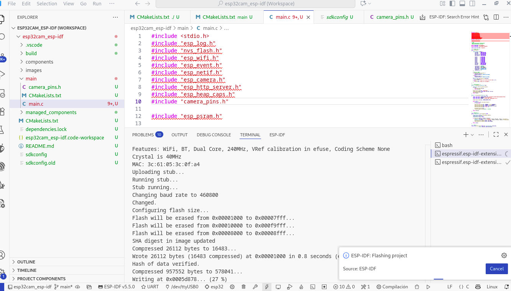

# ESP32-CAM IP Camera (ESP-IDF)

Este proyecto convierte un **ESP32-CAM** en una cámara IP accesible vía WiFi, usando **ESP-IDF**. Permite ver un stream en tiempo real en el navegador y es compatible con distintos modelos de ESP32-CAM mediante `camera_pins.h`.

---

## Tabla de Contenidos
- [Modelo usado](#modelo-usado)
- [Requisitos](#requisitos)
- [Instalación](#instalación)
- [Configuración](#configuración)
- [Compilación y Flasheo](#compilación-y-flasheo)
- [Uso](#uso)
- [Notas y Solución de Problemas](#notas-y-solución-de-problemas)
- [Estructura del Proyecto](#estructura-del-proyecto)

---
## Modelo usado


Muy recomendable adquirir además el housing que se vende, no solo nos facilita las conexiones, nos brinda la alimentación adecuada y además provee un puerto com para debug (igual a un Bridge USB-232).


En este modelo el botón de Reset del ESP32-CAM está del otro lado de la placa.


## Requisitos

- ESP32-CAM (AI-Thinker u otro modelo compatible, definido en `camera_pins.h`)
- **Ubuntu / Linux** (o equivalente) con USB disponible para flashear
- [ESP-IDF 5.x](https://docs.espressif.com/projects/esp-idf/en/stable/esp32/get-started/index.html)
- Python 3.11+ (para el monitor y scripts de IDF)
- Conexión a internet para descargar librerías y dependencias
- Plugin ESP-IDF en Visual Studio Code

---

## Instalación

1. **Clonar el proyecto**
```bash
git clone <repo-url> esp32cam_esp-idf
cd esp32cam_esp-idf
```
## Configuración
Click en el botón config (ícono de ruedita en la barra de abajo)


Ir a:
Component config -> ESP PSRAM -> Habilitar "Support for external, SPI-connected RAM"


No olvidar
### Click en Save!

## Compilación

Click en el botón con ícono de llave francesa


## Flashear
Con la compilación OK. Click en el botón Flash ícono relámpago.
(La primera vez que se hace click en flash arriba aparecerán varias opciones, elegir UART.)


En caso de error corroborar la elección del dispositivo correcto, el actual se muestra abajo como /dev/ttyUSB0.

Además hay que forzar el ESP32-CAM para que entre modo de "flaseho":


Click y mantener el botón para entrar en modo programación (en el housing o base especial), luego click en Reset en placa ESP32-CAM, soltar Reset, soltar botón de modo programación.




## Monitor
Click en el botón Monitor

Botón de Reset de la placa ESP32-CAM y monitoreando:


## Probar

Abrir un web browser con la IP que muestra el monitor:

http://192.168.1.161/stream


